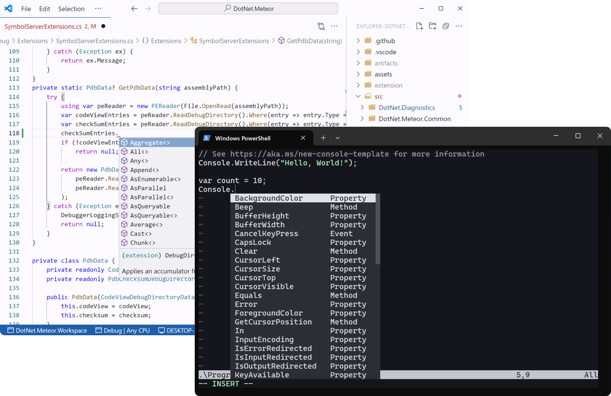

### C# Development Environment for Visual Studio Code
&emsp;DotRush is a powerful, lightweight, and efficient **C# Development Environment** designed for **VS Code**. Built with performance and simplicity in mind, DotRush provides a seamless development experience for C# developers.

<br clear="right"/>

<p align="center">
  <a href="https://github.com/JaneySprings/DotRush/blob/main/src/NeoVim/Readme.md">For Neovim Users</a> | <a href="https://github.com/JaneySprings/DotRush/blob/main/src/Zed/Readme.md">For Zed Users</a> | <a href="https://github.com/JaneySprings/DotRush/blob/main/src/SublimeText/Readme.md">For Sublime Users</a>
</p>

## Overview

- **C# IntelliSense** </br>
Roslyn-based autocompletion, suggestions, and code navigation to help you write code faster.

- **.NET Core Debugger** </br>
Debug your C# applications with the built-in .NET Core Debugger.

- **.NET Core Profiler** </br>
Profile your .NET Core applications with the built-in profiler tools.

- **Unity Debugger** </br>
Debug your Unity projects with the integrated Mono Debugger.

- **Test Explorer** </br>
Run and debug your unit tests with the integrated Test Explorer.

- **Code Decompilation** </br>
Instantly decompile code with [ICSharpCode Decompiler](https://github.com/icsharpcode/ILSpy/) to view the underlying source.

- **Multitarget Diagnostics** </br>
Real-time linting and error detection to catch issues early in all target frameworks of your project.

- **Multi-platform Support** </br>
Seamless integration with both VS Code and NeoVim on Windows, macOS, and Linux.

- **Performance** </br>
Lightweight and efficient, DotRush is designed to be fast and responsive.


## Working with Projects and Solutions
&emsp;If your folder contains multiple projects or a solution file, DotRush will show the following picker for all projects and solutions in the folder. DotRush automatically saves selected projects and solutions in the workspace settings. You can open it manually by executing the `DotRush: Pick Project or Solution files` command:


## Running and Debugging .NET Core Applications
&emsp;To run and debug your .NET Core applications, you can use the built-in .NET Core Debugger. You can start debugging by pressing **F5** and select the **.NET Core Debugger** configuration. You can also create a `launch.json` file with the following content:

```jsonc
{
    "version": "0.2.0",
    "configurations": [
        {
            "name": ".NET Core Debugger (launch)",
            "type": "coreclr",
            "request": "launch",
            "program": "${command:dotrush.activeTargetPath}",
            "preLaunchTask": "dotrush: Build"
        },
        {
            "name": ".NET Core Debugger (attach)",
            "type": "coreclr",
            "request": "attach",
            "processId": "${command:dotrush.pickProcess}"
        }
    ]
}
```
&emsp;You can change the startup project by clicking on it and executing the `Set as Startup Project` command from the context menu. You can also change the debugger options in the VSCode settings.


## Running and Debugging NUnit / xUnit Tests
&emsp;To run and debug your **NUnit** or **xUnit** tests, you can use the integrated Test Explorer in VSCode. Run test by clicking on the run button next to the test or debug it by right-clicking on the run button and selecting the `Debug Test` option in the context menu.


## Debugging Unity Projects
&emsp;To debug your Unity project, you can use the integrated Mono Debugger. Open the Unity project in VSCode (for example, by opening it from the Unity Editor) and start debugging by pressing **F5** and select the **Unity Debugger** configuration. You can also create a `launch.json` file with the following content:

```jsonc
{
    "version": "0.2.0",
    "configurations": [
        {
            "name": "Unity Debugger",
            "type": "unity",
            // Attach to Android device
            // "transportArgs": {
            //     "type": "android"
            // },
            "request": "attach"
        }
    ]
}
```

&emsp;You can change the debugger options in the VSCode settings.


## Debugging Godot Projects
&emsp;To debug your Godot project, open it in VSCode and create a `launch.json` file with the following content (adjust the `processPath` to the location of your Godot Engine executable):
```jsonc
{
    "version": "0.2.0",
    "configurations": [
        {
            "name": ".NET Core Debugger (attach)",
            "type": "coreclr",
            "request": "attach",
            "processPath": "C:\\Programs\\Godot\\Godot_v4.4.1-stable_mono_win64.exe",
            "preLaunchTask": "dotrush: Build"
        }
    ]
}
```

&emsp;Press **F5** to start debugging. It will launch the Godot Engine and attach the debugger to it:


## Profiling .NET Core Applications
&emsp;To profile your .NET Core applications, you can use the built-in **dotnet-trace** and **dotnet-gcdump** tools. You can attach the profiler to a running process by executing the `DotRush: Attach Trace Profiler` or `DotRush: Create Heap Dump` commands. Also you can use the following buttons in the debugger toolbar if you have the **.NET Core Debugger** running:


- For the `trace` report, you can use the [Speedscope in VSCode](https://marketplace.visualstudio.com/items?itemName=sransara.speedscope-in-vscode) extension to view it. Alternatively, you can upload it directly to the [speedscope](https://www.speedscope.app) site.
- For the `gcdump` report, you can use the [dotnet-heapview](https://github.com/1hub/dotnet-heapview) or _Visual Studio for Windows_.

## Limitations
&emsp;DotRush currently supports **only C# language** features and does not support `Razor`, `XAML`, or other languages. Also it does not support the following language features:

- **CodeLens** </br>
DotRush does not support [CodeLens features](https://code.visualstudio.com/api/language-extensions/programmatic-language-features#codelens-show-actionable-context-information-within-source-code) such as references, tests, and other CodeLens features.
