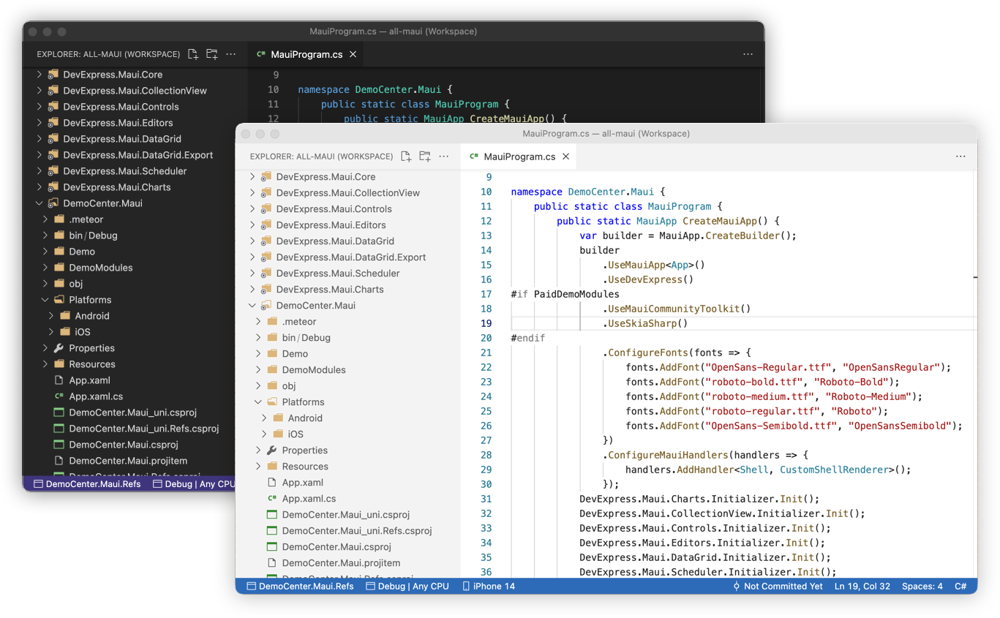

## Overview

### C# Development Environment for Visual Studio Code
DotRush is a lightweight VSCode extension that has basic IDE functions for working with C# language. You can navigate through your code, view errors in files, and apply code fixes.

 

## Features

* **Multitargeting Support**
 
Readme in progress...

* **Unity Support**
 
Readme in progress...

* **Everything is `.code-workspace`**
 
Readme in progress...

* **Roslyn Analyzers Support**
 
Readme in progress...

