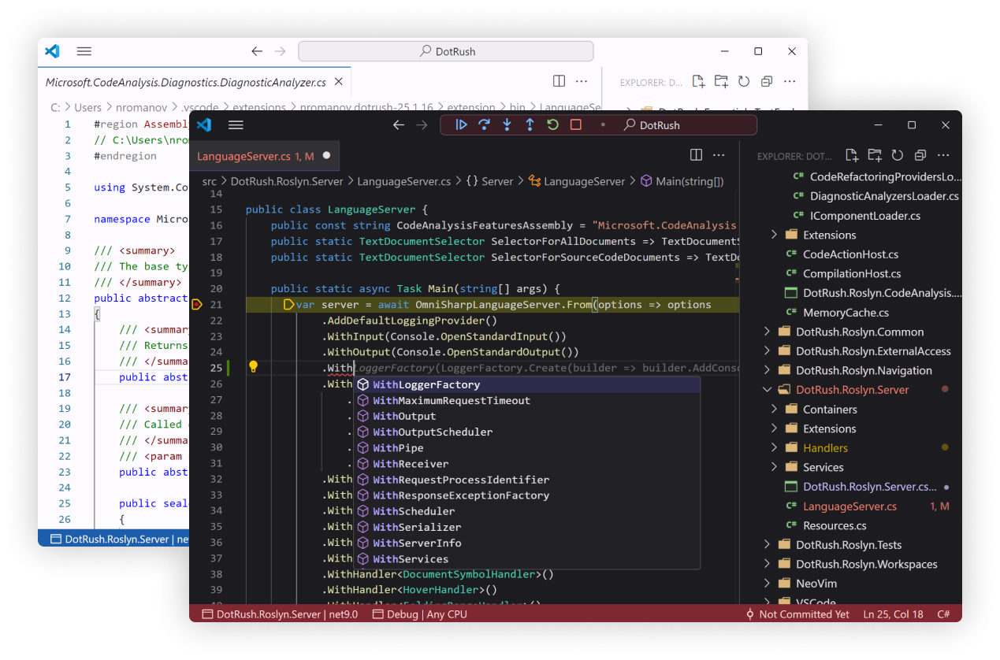

### C# Development Environment for Visual Studio Code
&emsp;DotRush is a powerful, lightweight, and efficient **C# Development Environment** designed for **VS Code**. Built with performance and simplicity in mind, DotRush provides a seamless development experience for C# developers.

 

## Overview

- **C# IntelliSense**  
Roslyn-based autocompletion, suggestions, and code navigation to help you write code faster.

- **.NET Core Debugger**  
Debug your C# applications with the built-in .NET Core Debugger.

- **Test Explorer**  
Run and debug your unit tests with the integrated Test Explorer.

- **Code Decompilation**  
Instantly decompile code with [ICSharpCode Decompiler](https://github.com/icsharpcode/ILSpy/) to view the underlying source.

- **Multitarget Diagnostics**  
Real-time linting and error detection to catch issues early in all target frameworks of your project.

- **Multi-platform Support**  
Seamless integration with both VS Code and NeoVim on Windows, macOS, and Linux.

- **Performance**  
Lightweight and efficient, DotRush is designed to be fast and responsive.

## Working with Projects and Solutions
&emsp;If your folder contains multiple projects or a solution file, DotRush will show the following picker for all projects and solutions in the folder. DotRush automatically saves selected projects and solutions in the workspace settings. You can open it manually by executing the `DotRush: Pick Project or Solution files` command:

