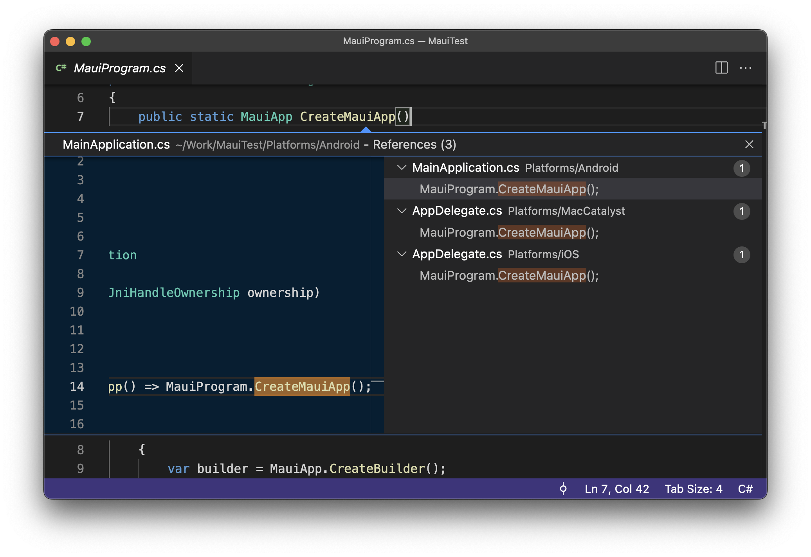
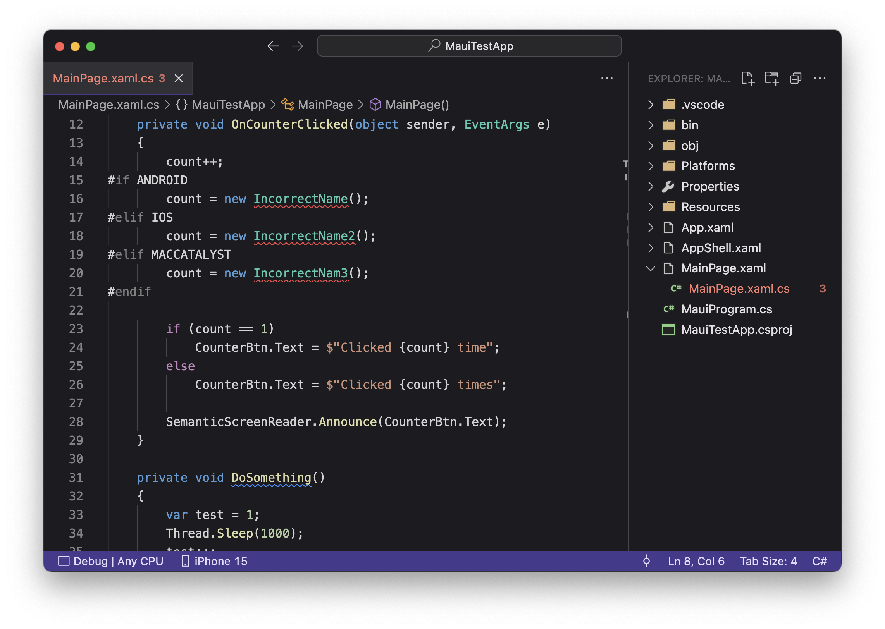
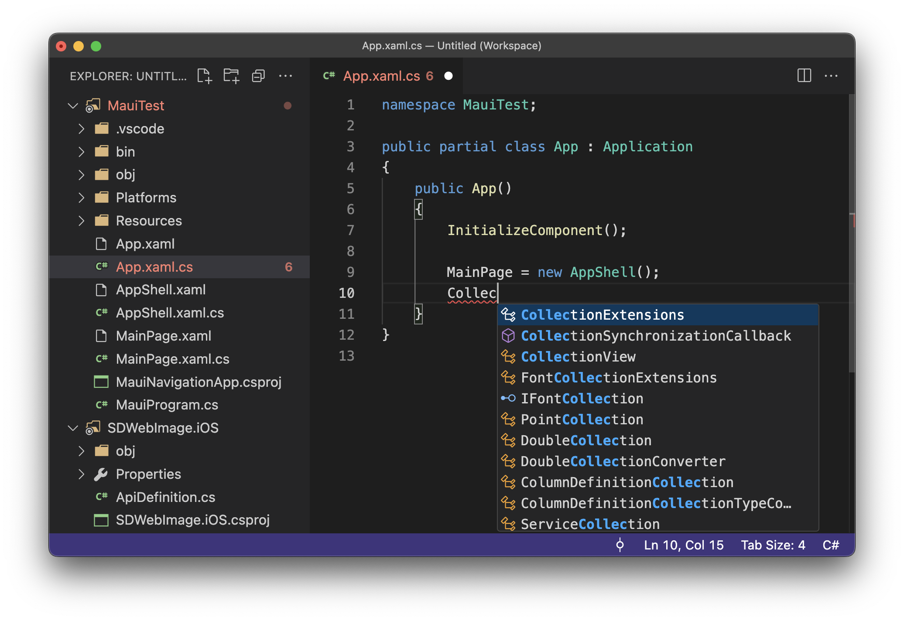
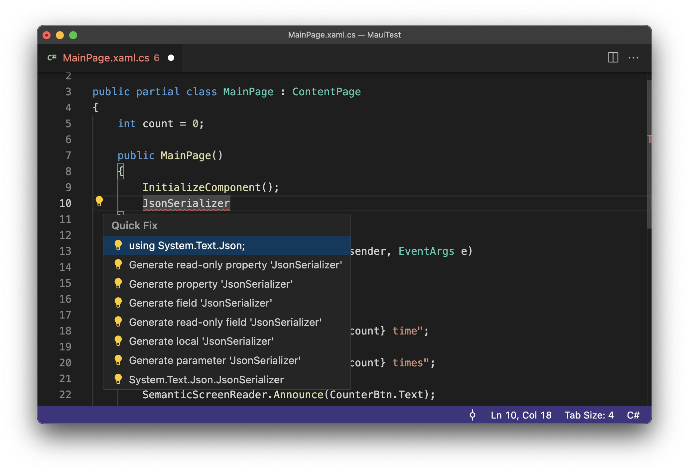

## Overview

### C# Development Environment for Visual Studio Code
DotRush is a VSCode extension for `.NET` `C#` developers designed to unlock a plethora of IDE capabilities. DotRush helps you organize multiple projects and includes features for `code editing`, `refactoring` and `error detection`. Even in the most extensive projects, DotRush is a resource-friendly companion, ensuring you stay productive and focused.

 

## Features

### IntelliSense in Multi-Target Projects
&emsp;DotRush offers IntelliSense for multiple Target Frameworks. For example, when you're working on a cross-platform application and your current target framework is Android, DotRush provides text autocomplete suggestions for iOS, too.

### Cross-Platform Error Detection
&emsp;DotRush highlights errors and displays descriptions in all Target Frameworks used in your project.

### Multiple Project Management
&emsp;Empowering you with [Code Workspaces](https://code.visualstudio.com/docs/editor/workspaces) DotRush lets you effortlessly combine multiple projects and apply different settings to them. DotRush seamlessly activates all features when you add a new folder to your workspace. **Note that `.sln` files are not supported.**

### Quick Fixes
&emsp;Activate error quick fixes with the handy "..." shortcut or by right-clicking on problematic code:

### Prerequisites
- Framework: `.NET 6/7/8`
- Operating System: `Windows`, `Linux`, `MacOS`
- Architecture: `x64`, `ARM64`

## More for VSCode Developers
&emsp;Check out [.NET Meteor](https://github.com/JaneySprings/DotNet.Meteor) – a cross-platform VSCode extension to build, debug .NET apps and deploy them to devices or emulators.
